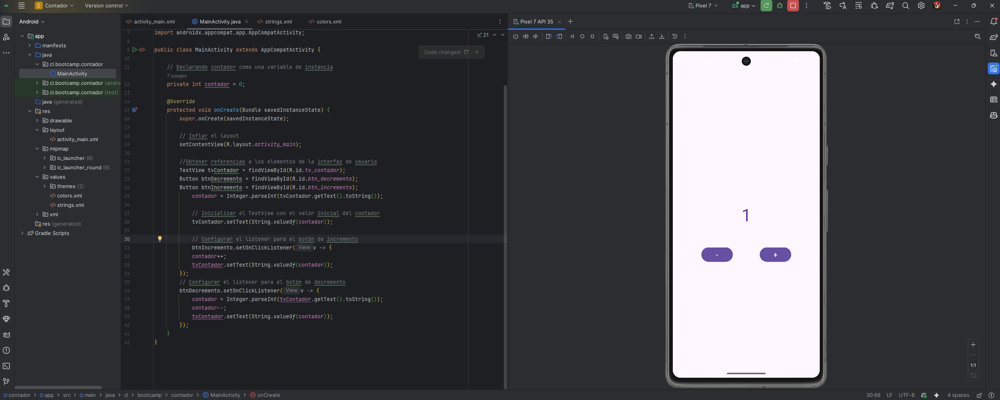
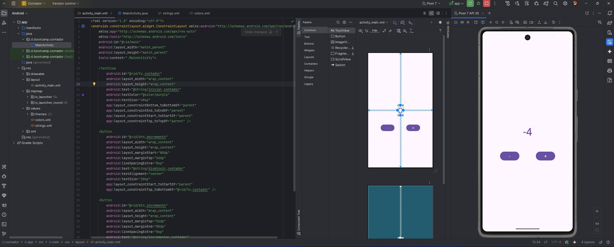

**_<h1 align="center">:vulcan_salute: Proyecto Realizado con Andoid Studio - Contador :computer:</h1>_**

**<h3>:blue_book: Contexto del proyecto:</h3>**

<p>Pantalla con dos botones que al hacer click aumentan ( + ) o disminuyen ( - ).</p>
<p>Al hacer click en aumento se mantiene el color del número, mientras que al hacer click en el botón de decremento cambia el número a color</p>

**<h3>📁 Estructura del Proyecto Android:</h3>**

```Android
📘 README.md
📁 app
├── 📁 manifest
│   └── 🟧 AndroidManifest.xml
├── 📁 java
│   ├── 📁 cl.bootcamp.holamundo
│   │   └── 🟦 MainActivity.java
│   ├── 📁 cl.bootcamp.holamundo (android Test)
│   │   └── 🟦 ExampleInstrumentedTest.java
│   └── 📁 cl.bootcamp.holamundo (test)
│       └── 🟦 ExampleUnitTest.java
├── 📁 java (generated)
├── 📁 res
│   ├── 📁 drawable
│   │   │    ├── 🖼️ hello_world_cellphone.png
│   │   │    ├── 🖼️ image_project.jpg
│   │   │    ├── 🖼️ world.jpg
│   │   │    ├── 🟧 ic_launcher_background.xml
│   │   │    └── 🟧 ic_launcher_foreground.xml
│   ├── 📁 layout
│   │   └── 📁 activity_main.xml
│   ├── 📁 mipmap
│   │   ├── 📁 ic_launcher
│   │   └── 📁 ic_launcher_round
│   ├── 📁 values
│   │   ├── 📁themes
│   │   │   ├── 🟧 themes.xml
│   │   │   └── 🟧 themes.xml (night)
│   │   ├── 🟧 colors.xml
│   │   └── 🟧 strings.xml
│   └── 📁 xml
📁 Gradle Scripts
├── 🟦 build.gradle.kts (Project: Contador)
├── 🟦 build.gradle.kts (Module: app)
├── 🟦 proguard-rules.pro (ProGuard rules for ":app")
├── 🟦 gradle.properties (Project properties)
├── 🟦 gradle-wrapper.properties (Gradle Version)
├── 🟦 libs.versions.toml (version Catalog "libs")
├── 🟦 local.properties (SDK Location)
└── 🟦 settings.gradle.kts (Project Settings)
```

**<h3>:book: Imagen general del proyecto:</h3>**



**<h3>:book: Imagen emulador celular:</h3>**

